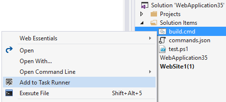
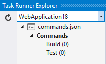
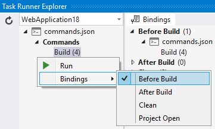

## Command Task Runner extension

Adds support for command line batch files in Visual Studio 2015's
Task Runner Explorer. Supports `.cmd`, `.bat`, `.ps1` and `.psm1` files.

[](https://ci.appveyor.com/project/madskristensen/commandtaskrunner)

Download the extension at the
[VS Gallery](https://visualstudiogallery.msdn.microsoft.com/9397a2da-c93a-419c-8408-4e9af30d4e36)
or get the
[nightly build](http://vsixgallery.com/extension/fc1aafb2-321e-41bd-ac37-03b09ea8ef31/)

### Add commands

The easiest way to add a batch file to Task Runner Explorer
is to right-click it in Solution Explorer and select
**Add to Task Runner**



You can right-click supported batch files in either solution
folders or from within a any project.

Doing so will create a `commands.json` file. If you right-clicked
a batch file in a solution folder, then the `commands.json`
file will be placed in the solution folder. If the batch file
is in a project you will be prompted to select to either
put it in the project or solution folder.

If a `commands.json` file already exist, the new batch
file will be added.

### Commands

Inside commands.json it is possible to add custom scripts inside
the "scripts" element.

```js
{
	"commands": {
		"Build": {
			"FileName": "cmd.exe",
			"WorkingDirectory": ".",
			"Arguments": "/c build\\build.cmd"
		}
	}
}
```

### Commands with no batch file

You can execute any command inside `commands.json` by manually
editing it. A batch file is not needed if you just need to
execute simple commands.

### Execute scripts

When scripts are specified, the Task Runner Explorer
will show those scripts.



Each script can be executed by double-clicking the task.

### Drag and drop

You can drag any supported batch file onto `commands.json`
to add it. Just keep in mind that Visual Studio doesn't support
drag and drop from solution folders.

### Bindings

Script bindings make it possible to associate individual scripts
with Visual Studio events such as "After build" etc.



### Intellisense

If you manually edit bindings in `command.json``,
then full Intellisense is provided.

